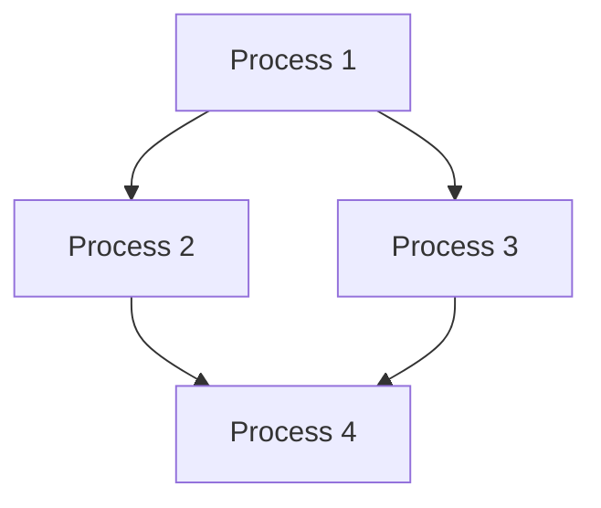

# LRSVZZ-2025
Bienvenue sur le repository pour le projet "MechaDelivery". 

## Introduction 
Le projet est divisé en plusieurs parties. 

- [ ] **[Projet](docs/Projet.md)** (à lire en premier) 
- [ ] [Hardware](docs/Hardware.md) 
- [ ] [Software](docs/Software.md) 
- [ ] [Design](docs/Design.md) 

## Auteurs 
- Alice LIN 
- Thisalini RAVINTHIRAN 
- Lilian SAFAR 
- Djivan Julien VARTANIAN 
- Benjamin ZHANG 
- Louise ZHENG 

