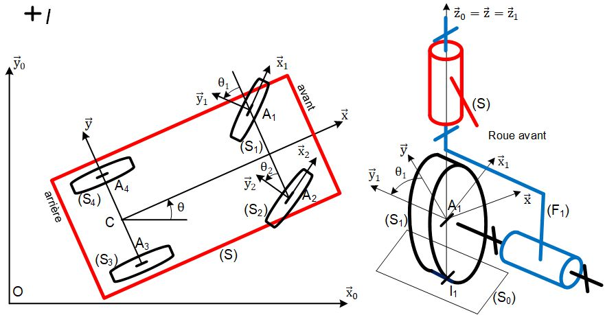

# Théorique 
On veut : 

- dimensionner le moteur 
- dimensionner la batterie 
- rendre le système stable 

## Cinématique 
### Modélisation 
On cherche la relation entre la vitesse de rotation des roues et la vitesse du robot et sa vitesse de rotation par rapport au sol. 

Un 

- $S$ est le châssis 
- $R_0$ est le référentiel terrestre 
- $S_i$ est la roue n°i (il y en a quatre) 
- $F_i$ est la fusée n°i (il y en a deux) 

Deux 

- $A_i$ est un point qui représente le point de contact entre la roue n°$i$ et le sol 
- $R$ est le rayon de la roue 
- $\omega$ est la vitesse de rotation 

Trois 

- $\vec{x},\vec{y},\vec{z} \in S$ 
- $\vec{x_0}, \vec{y_0}, \vec{z_0} \in S_0$ 
- $\vec{x_1},\vec{y_1},\vec{z_1} \in F_1$ 
- $\vec{x_2},\vec{y_2},\vec{z_2} \in F_2$ 
- $S_1$ et $S_2$ sont respectivement confondues avec $F_1$ et $F_2$ 
- $S_4$ et $S_3$ sont confondues avec $S$ 

Condition de roulement sans glissement : 
$$
\vec{V}(A_4, S/R_0) = R\omega_{S_4/S} \cdot \vec{x} \tag{1}
$$

$$
\vec{V}(A_3, S/R_0)=R\omega_{S_3/S} \cdot \vec{x} \tag{2}
$$

Rotation d'une roue par rapport à $R_0$, obtenu par composition des vitesses de rotation. 
$$\vec{\Omega}(S_3/R_0) = \omega_{S_3/S} \cdot \vec{y} + \omega_{S/R_0} \cdot \vec{z} \tag{3}$$
$$\vec{\Omega}(S_4/R_0) = \omega_{S_4/S} \cdot \vec{y} + \omega_{S/R_0} \cdot \vec{z} \tag{4}$$

### Étape 1 

Relation entre vitesse de rotation des roues et la vitesse du châssis. 

$$
R\omega_{S_4/S} \cdot \vec{x} + R\omega_{S_3/S} \cdot \vec{x} =
\vec{V}(A_4, S/R_0) + \vec{V}(A_3, S/R_0) 
\tag{1)+(2}
$$

Changement de point en $C$. 
$$ = 
\vec{V}(C,S/R_0) 
+ \overrightarrow{A_{4}C} \wedge \vec{\Omega}(S/R_0) 
+ \vec{V}(C,S/R_0) 
+ \overrightarrow{A_{3}C} \wedge \vec{\Omega}(S/R_0) 
$$
$$
= 2\vec{V}(C,S/R_0) + (-\frac{L}{2} + \frac{L}{2}) \cdot \vec{y} \wedge \omega_{S/R_0} \cdot \vec{y}
$$
Donc selon $x$, on a : 
$$
\boxed{
	\vec{V}(C,S/R_0) = \frac{R}{2}\bigg( \omega_{S_4/S} + \omega_{S_3/S} \bigg)
}
$$
### Étape 2 

Relation entre vitesse de rotation des roues et la **vitesse de rotation** du châssis. 

$$
R\omega_{S_4/S} \cdot \vec{x} - R\omega_{S_3/S} \cdot \vec{x} =
\vec{V}(A_4, S/R_0) - \vec{V}(A_3, S/R_0) 
\tag{1)–(2}
$$

Changement de point en $I$, point sur l'axe de rotation du châssis par rapport au sol : $(I,\vec{z})$. 
$$= 
\vec{V}(I, S/R_0) + \overrightarrow{A_4 I} \wedge \vec{\Omega}(S/R_0) 
- \bigg(\vec{V}(I, S/R_0) + \overrightarrow{A_3 I} \wedge \vec{\Omega}(S/R_0) \bigg)
$$
$I$ centre de l'axe de rotation donc $\vec{V}(I, S/R_0) = \vec0$
On a alors : 
$$
= \overrightarrow{A_4 I} \wedge \vec{\Omega}(S/R_0) 
- \bigg( \overrightarrow{A_3 I} \wedge \vec{\Omega}(S/R_0) \bigg)$$
On décompose avec la relation de Chasles : 

$$
= \bigg(\overrightarrow{A_4 I_4}+\overrightarrow{I_4 I} \bigg)
\wedge \vec{\Omega}(S/R_0) 
- \Bigg( 
	\bigg(
		\overrightarrow{A_3 I_3} 
		+ \overrightarrow{I_3 I_4} 
		+ \overrightarrow{I_4 I}
	\bigg) 
	\wedge \vec{\Omega}(S/R_0) 
\Bigg)
$$

$$
= \bigg( -R\vec{z}+\overrightarrow{I_4 I} \bigg)
\wedge {\omega}_{S/R_0} \cdot \vec{z} 
- 
\Bigg( 
	\bigg( 
		-R\vec{z} + L\vec{y} +\overrightarrow{I_4I}
	\bigg) 
	\wedge {\omega}_{S/R_0} \cdot \vec{z}  
\Bigg)
$$

$$
= - \Bigg( 
	\bigg( 
		L\vec{y} 
	\bigg) 
	\wedge {\omega}_{S/R_0} \cdot \vec{z}  
\Bigg)
$$

$$
= - \Bigg( 
	\bigg( 
		L
	\bigg) 
	{\omega}_{S/R_0}
	\cdot \vec{x}
\Bigg)
$$

Donc : 
$$
R\omega_{S_4/S} \cdot \vec{x} - R\omega_{S_3/S} \cdot \vec{x}
= -L {\omega}_{S/R_0} \cdot \vec{x}
$$

Selon $\vec{x}$ : 
$$
R\omega_{S_4/S} - R\omega_{S_3/S} 
= -L {\omega}_{S/R_0} 
$$

Donc : 
$$
\boxed{
	\omega_{S_3/S} - \omega_{S_4/S} 
	= \frac{L}{R} {\omega}_{S/R_0}
}
$$

Fin de la cinématique. 

## Dynamique 
### Modélisation 
Torseur d'action mécanique avec $i \in \{1,2,3,4\}$ : 
$$
F(\text{route} \to S_i) = 
\begin{Bmatrix}
	T_{ri} \cdot \vec{x} + N_{ri} \cdot \vec{z} 
	\\
	\vec0
\end{Bmatrix}_{I_{i}}
$$

Limite de roulement sans glissement : $T_{ri,\text{max}} = f \times N_{ri, \text{max}}$. 
$$
F(S \to S_i) = 
\begin{Bmatrix}
	X_i \cdot \vec{x} + Y_i \cdot \vec{y} + Z_i \cdot \vec{z} \\
	L_i \cdot \vec{x} + N_i \cdot \vec{z}
\end{Bmatrix}_{A_{i}}
$$

$$
F(S_{\text{moteur}_3}\to S_3) = 
\begin{Bmatrix}
	\vec{0} \\
	C_{m_3} \cdot \vec{y} 
\end{Bmatrix}_{A_{3}}
$$
$$
F(S_{\text{moteur}_4}\to S_4) = 
\begin{Bmatrix}
	\vec{0} \\
	C_{m_4} \cdot \vec{y} 
\end{Bmatrix}_{A_{4}}
$$

$$
F(P \to S) = 
\begin{Bmatrix}
	-mg\vec{z} \\
	\vec0 
\end{Bmatrix}_{G}
$$
Avec $i \in \{1,2\}$ : 
$$
F(S \to F_i) = 
\begin{Bmatrix}
	X_{F_i} \cdot \vec{x} + Y_{F_i} \cdot \vec{y} + Z_{F_i} \cdot \vec{z} \\
	L_{F_i} \cdot \vec{x} + M_{F_i} \cdot \vec{y}
\end{Bmatrix}_{A_{i}}
$$

$$
F(F_i \to S_i) = 
\begin{Bmatrix}
	X_{F_i S_i} \cdot \vec{x_i} + Y_{F_i S_i} \cdot \vec{y_i} + Z_{F_i S_i} \cdot \vec{z_i} \\
	L_{F_i S_i} \cdot \vec{x_i} + N_{F_i S_i} \cdot \vec{z_i}
\end{Bmatrix}_{A_{i}}
$$

PFO sur les roues arrières

$$\ {D}({S_i/R_0}) = \ {F}({S \rightarrow S_i)} + \ {F}{(\text{roue} \rightarrow S_i)} + \ {F} ({S_{rot_i}\rightarrow S_i)}$$

masse des roues négligeable $$\vec{D}_{S_i/R_0} = \begin{Bmatrix}
	 \vec{0} \\
	\vec{0}\\ \end{Bmatrix}_{\forall P}$$

$$
\vec{M}_{Ai}({\text{roue} \rightarrow S_i)} = \vec{M}_{I_i}({S_i \rightarrow S_i)} + \left( \overrightarrow{A_iI_i} \right) \wedge \vec{T}_{rix} + \vec{N}_{r_i} \vec{z}
$$

$$ = \vec{O} + ({-R}\vec{z}
$$