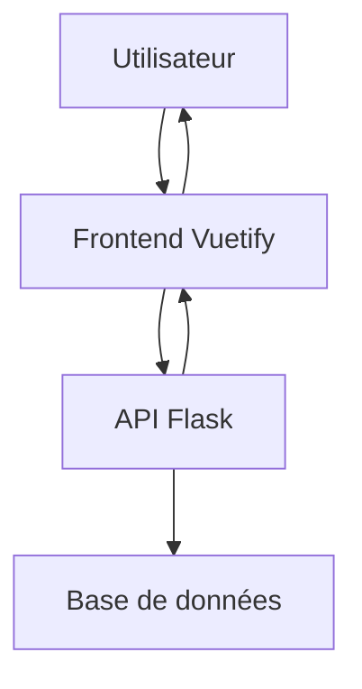

Pour créer une plateforme web, il est effectivement courant d'utiliser un backend et un frontend. Voici un aperçu de la façon dont Flask (pour le backend) et Vuetify (pour le frontend) peuvent interagir.

### Concepts de base

1. **Backend (Flask)** : C'est la partie de votre application qui gère la logique métier, l'accès à la base de données, l'authentification, etc. Flask est un framework web léger pour Python qui vous permet de créer des API RESTful.

2. **Frontend (Vuetify)** : C'est la partie de votre application que les utilisateurs voient et avec laquelle ils interagissent. Vuetify est un framework basé sur Vue.js qui vous permet de créer des interfaces utilisateur réactives et attrayantes.

### Comment lier le backend et le frontend

1. **API RESTful** : Vous allez créer des endpoints dans votre application Flask qui renvoient des données au format JSON. Ces endpoints peuvent être appelés par le frontend.

2. **Appels AJAX** : Dans votre application Vuetify, vous utiliserez des appels AJAX (par exemple, avec Axios) pour interroger les endpoints de votre API Flask. Cela vous permettra de récupérer des données et de les afficher dans votre interface utilisateur.

### Schéma Mermaid

Voici un schéma Mermaid qui illustre la relation entre le frontend et le backend :

```mermaid
graph TD;
    A[Utilisateur] -->|Interagit avec| B[Frontend (Vuetify)];
    B -->|Fait des requêtes| C[API (Flask)];
    C -->|Accède à| D[Base de données];
    C -->|Renvoie des données| B;
    B -->|Affiche les données| A;
```

### Explication du schéma

- **Utilisateur** : L'utilisateur interagit avec l'interface utilisateur (frontend).
- **Frontend (Vuetify)** : Envoie des requêtes à l'API Flask pour obtenir des données.
- **API (Flask)** : Traite les requêtes, accède à la base de données si nécessaire, et renvoie les données au frontend.
- **Base de données** : Stocke les données que l'application utilise.

### Étapes à suivre

1. **Configurer Flask** : Créez des routes dans Flask qui renvoient des données au format JSON.
2. **Configurer Vuetify** : Utilisez Axios ou Fetch API pour faire des appels à votre API Flask.
3. **Tester l'intégration** : Assurez-vous que le frontend peut récupérer et afficher les données du backend.

Si vous avez des questions spécifiques sur l'une de ces étapes ou si vous avez besoin de plus de détails, n'hésitez pas à demander !


